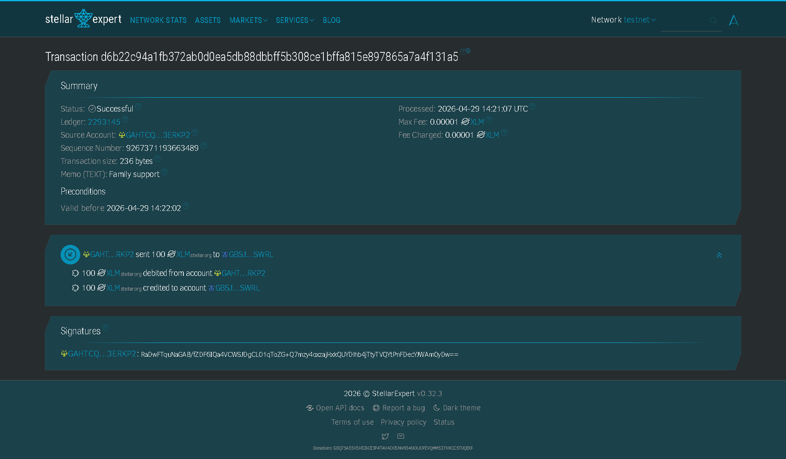
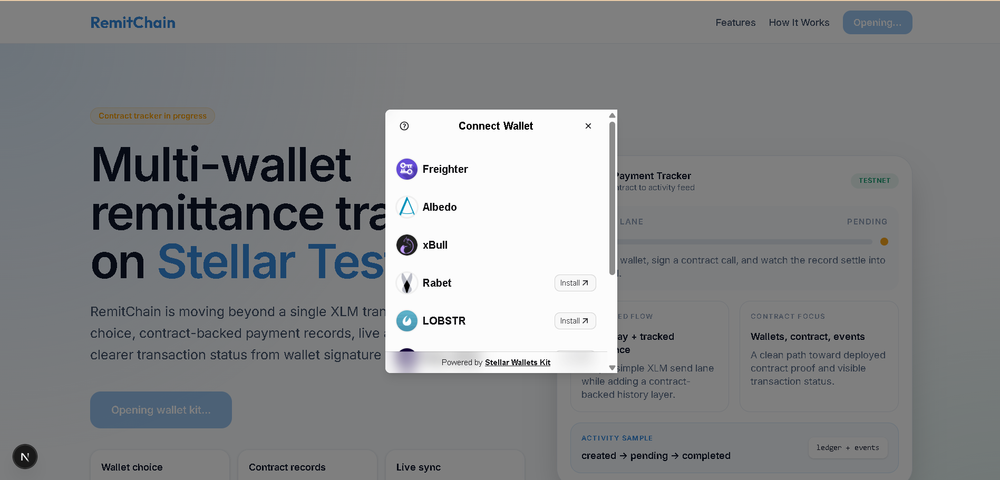

# RemitChain ⚡

[](https://stellar.expert/explorer/testnet)
[](https://developers.stellar.org/docs/build/smart-contracts/overview)
[](https://remitchain.vercel.app)

> **Stellar + Soroban dApp for modern, tracked remittances.**
> Connect a wallet, send payments, and track contract-backed remittance records with real-time event synchronization.

**Live App** → [https://remitchain.vercel.app](https://remitchain.vercel.app)
**GitHub** → [https://github.com/tanaygt/RemitChain](https://github.com/tanaygt/RemitChain)

---

## Table of Contents

- [What is RemitChain?](#what-is-remitchain)
- [Level 1 — White Belt](#level-1--white-belt)
- [Level 2 — Yellow Belt](#level-2--yellow-belt)
- [Tech Stack](#tech-stack)
- [Local Setup](#local-setup)
- [Contract Development](#contract-development)

---

## What is RemitChain?

Traditional remittances are often "send and forget." **RemitChain** is a belt-by-belt Stellar dApp that evolves from a basic XLM payment tool into a full Soroban remittance platform with real-time tracking, contract-backed status, and live event synchronization.

---

## Level 1 — White Belt

**The basics: wallet connect, XLM balance, testnet payment.**

Covers the core Stellar fundamentals — Freighter wallet connect/disconnect, XLM balance from Horizon, testnet payment flow, and success/failure feedback with transaction hash verification.

**What was built:**
- Freighter wallet connect and disconnect
- Stellar Testnet enforcement
- XLM balance display from Horizon
- Testnet XLM payment with pending → success → failure states
- Transaction hash with Stellar Expert verification link

**Screenshots:**

| Balance + In-App Result | Transaction on Stellar Expert |
|---|---|
|  <br> *Dashboard showing connected wallet and real-time XLM balance.* |  <br> *External verification of the XLM transfer on Stellar Expert.* |

---

## Level 2 — Yellow Belt

**Multi-wallet + first Soroban contract deployed and called.**

Moved from Freighter-only to StellarWalletsKit, deployed a real remittance registry contract on Soroban testnet, and wired up frontend contract invocations with live event polling.

**What was built:**
- StellarWalletsKit wallet modal (Freighter, xBull, Albedo, etc.)
- Deployed Soroban Remittance Registry contract
- `create_remittance` from the frontend
- Contract reads: total count, pending/completed stats, recent activities
- Event feed polling from Soroban RPC
- Explicit error handling: wallet unavailable, user rejected, insufficient balance, BigInt serialization, and RPC range errors.

**Deployed contract:**

```
CCLUDU2DFAJ7H3UCHHCMPVN2ASRNKP3V3UWIMWC5MEUGTVNJ2IQ3EEPS
```

**On-chain proof:**

| Event | Transaction |
|---|---|
| Initialization | [8b64fa09...cbed26c67](https://stellar.expert/explorer/testnet/tx/8b64fa099020c5c86bbb65a16815d4c063153bb9437ca517443eae0cbed26c67) |
| Contract call | [fa3e568c...2830278b](https://stellar.expert/explorer/testnet/tx/b925b292fa12de239619b1dfdd7a40d4de218ae1de586310dc9adcdc2830278b) |

**Screenshots:**

#### Multi-wallet Integration
The application now supports multiple Stellar wallets via StellarWalletsKit, allowing users to choose their preferred provider.



#### Successful Contract Interaction
After signing the transaction, the dashboard provides immediate feedback. The screenshot below shows the successful "Contract remittance confirmed" state and the updated activity feed.


#### On-chain Verification (Soroban)
Verification of the `create_remittance` function call on the Stellar Expert explorer, showing the contract ID and passed parameters.


---

## Tech Stack

| Layer | Technology |
|---|---|
| Frontend | Next.js 16 (App Router), TypeScript, Vanilla CSS |
| Wallet | `@creit.tech/stellar-wallets-kit` (Freighter, xBull, Albedo, etc.) |
| Stellar SDK | `@stellar/stellar-sdk`, `@stellar/freighter-api` |
| Smart contracts | Rust, Soroban SDK (v26) |
| RPC | Soroban testnet RPC (`soroban-testnet.stellar.org`) |
| Horizon | Stellar Testnet Horizon |
| Deployment | Vercel |

---

## Local Setup

```bash
cd frontend
npm install
npm run dev
```

Open [http://localhost:3000](http://localhost:3000).

---

## Contract Development

**Build contracts:**

```bash
cd contracts/remit_registry
stellar contract build
```

**Contract source files:**

| Contract | Source |
|---|---|
| Remittance Registry | `contracts/remit_registry/src/lib.rs` |

---

*Built on Stellar and Soroban testnet · Rise In Challenge · April 2026*
