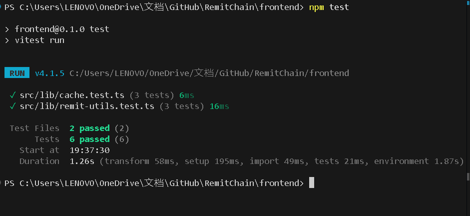

# Level 3 - Orange Belt Submission

## Overview

RemitChain Level 3 turns the Yellow Belt contract tracker into a more complete mini-dApp with stronger frontend quality, cached dashboard state, automated tests, and demo-ready documentation.

This level focuses on:

- loading states and progress indicators
- basic caching for dashboard data
- automated tests (6 passing)
- complete README coverage
- demo-ready product flow

## What Level 3 Adds

- loading state for wallet restore and dashboard bootstrapping
- progress feedback while live Soroban sync is running ("Syncing..." pulse)
- cached dashboard state in `localStorage`
- cached statistics and recent events restored before live refresh
- automated tests for utility logic, cache parsing, and amount conversion

## Mini-dApp Scope

The current Level 3 RemitChain app supports:

- multi-wallet connect through `StellarWalletsKit`
- Soroban `create_remittance` call
- frontend contract reads (Total count, Escrowed amount, Status stats)
- recent event feed polling
- transaction status visibility (Pending / Success / Fail)
- local dashboard cache restore after refresh

## Test Coverage

Run the Level 3 tests with:

```bash
npm test
```

Current automated coverage includes:

- XLM/stroops conversion helpers
- Dashboard cache parsing and sanitization
- Wallet error message mapping

Current local result:

- `6` tests passing with `npm test`

## Local Setup

```bash
npm install
npm run dev
```

Open [http://localhost:3000](http://localhost:3000).

## Live Demo

- Live app: [https://remitchain.vercel.app/](https://remitchain.vercel.app/)
- Demo video: [https://www.loom.com/share/af0d67a7005d4f95abc7edc756c56e0e](https://www.loom.com/share/af0d67a7005d4f95abc7edc756c56e0e)

## Level 3 Screenshots

### Test output showing passing tests

This screenshot shows the local Level 3 automated test run with `6` passing tests.



### Successful contract call from dashboard

This screenshot shows the successful remittance creation and the immediate feedback in the dashboard.


Verified contract call transaction:

- [fa3e568c...2830278b](https://stellar.expert/explorer/testnet/tx/b925b292fa12de239619b1dfdd7a40d4de218ae1de586310dc9adcdc2830278b)

## Required Submission Assets

- Test output screenshot:
  - yes
- Demo video link:
  - [https://www.loom.com/share/af0d67a7005d4f95abc7edc756c56e0e](https://www.loom.com/share/af0d67a7005d4f95abc7edc756c56e0e)

## Repository

- GitHub: [https://github.com/tanaygt/RemitChain](https://github.com/tanaygt/RemitChain)
