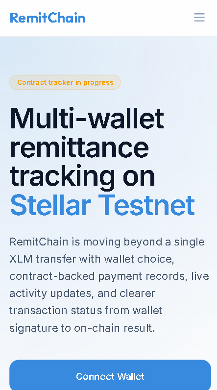

# RemitChain Level 4 - Green Belt

Level 4 turns RemitChain into a production-ready Soroban dApp with real testnet USDC escrow, inter-contract fee accounting, stronger dashboard UX, and CI coverage.

## What changed in Level 4

- real testnet `USDC` funded remittances through the Stellar Asset Contract
- `RemitRegistry` contract for funded remittance creation, completion, and refunds
- `FeeVault` contract for protocol fee accounting through an inter-contract call
- linked event feed for registry and fee events
- upgraded dashboard with XLM + USDC balances, trustline awareness, and funded remittance forms
- GitHub Actions CI for frontend and Soroban contracts
- mobile-friendly dashboard layout for the larger Level 4 surface area

## Live app

- [https://remitchain.vercel.app/](https://remitchain.vercel.app/)
- **Demo Video**: [https://www.loom.com/share/af0d67a7005d4f95abc7edc756c56e0e](https://www.loom.com/share/af0d67a7005d4f95abc7edc756c56e0e)

## Demo flow

- connect wallet with `StellarWalletsKit`
- confirm testnet USDC trustline
- fund a USDC remittance escrow
- view the fee vault side effect and event feed
- complete the remittance from the admin/recipient panel

## Level 4 contracts

- Registry contract:
  - `CCLUDU2DFAJ7H3UCHHCMPVN2ASRNKP3V3UWIMWC5MEUGTVNJ2IQ3EEPS`
- FeeVault contract:
  - `CBRAYXE2MCTP5MBDPT3CQNFARYVEYWQLMALVTWEYFUS6LBCQTAPIEK2T`
- Testnet USDC SAC:
  - `CBIELTK6YBZJU5UP2WWQEUCYKLPU6AUNZ2BQ4WWFEIE3USCIHMXQDAMA`

## Testnet transactions

- FeeVault deployment:
  - [b598b47e6a26a0a6fe73410fe1de6bf0d616bb4b2d71006bd1547590bf8a2c50](https://stellar.expert/explorer/testnet/tx/b598b47e6a26a0a6fe73410fe1de6bf0d616bb4b2d71006bd1547590bf8a2c50)
- Registry deployment:
  - [ffb634147358bdd45b6717947299b3812fc7a1efb14541c585c9bf4de4a21a14](https://stellar.expert/explorer/testnet/tx/ffb634147358bdd45b6717947299b3812fc7a1efb14541c585c9bf4de4a21a14)
- Funded remittance create + inter-contract fee record:
  - [1507525771707cd038fd6e88c72730d22e2e31324512328a069d3aa4b4258890](https://stellar.expert/explorer/testnet/tx/1507525771707cd038fd6e88c72730d22e2e31324512328a069d3aa4b4258890)

## 📸 Technical Proofs

### 1. CI/CD Success

[](https://github.com/tanaygt/RemitChain/actions/workflows/ci.yml)

### 2. Mobile Responsive View



### 3. Contract Interactions (RPC Events)


## Requirement coverage

### Inter-contract call working

Yes.

- `RemitRegistry.create_remittance()` triggers a fee record in `FeeVault`
- `RemitRegistry` calls `FeeVault.deposit_fees()` inside the same contract flow
- the funded remittance transaction above proves the inter-contract path on testnet

### Custom token or pool deployed

RemitChain Level 4 uses real testnet `USDC` for remittance funding and a deployed `FeeVault` for fee share accounting.

- payment asset is not a mock token
- fee accounting is handled in a separate deployed contract

### CI/CD running

- workflow file:
  - [\.github/workflows/ci.yml](./.github/workflows/ci.yml)
- checks:
  - frontend lint
  - frontend tests
  - frontend build
  - Soroban contract build

### Mobile responsive

Yes.

- the dashboard stacks metrics, forms, and activity cards cleanly on smaller breakpoints
- components collapse into a single-column mobile layout for better accessibility

## Local setup

```bash
npm install
npm run dev
```

Open [http://localhost:3000](http://localhost:3000).

## Contract development

Run frontend checks:

```bash
npm run lint
npm test
npm run build
```

Build Soroban contracts:

```bash
stellar contract build
```

## Testnet USDC note

Level 4 uses the official Stellar testnet USDC asset:

- asset:
  - `USDC:GBBD47IF6LWK7P7MDEVSCWR7DPUWV3NY3DTQEVFL4NAT4AQH3ZLLFLA5`

Before creating a funded remittance from the UI:

- add the `USDC` trustline
- fund the wallet with testnet USDC
- then use the dashboard remittance form

---

*Built on Stellar and Soroban testnet · Rise In Challenge · April 2026*
